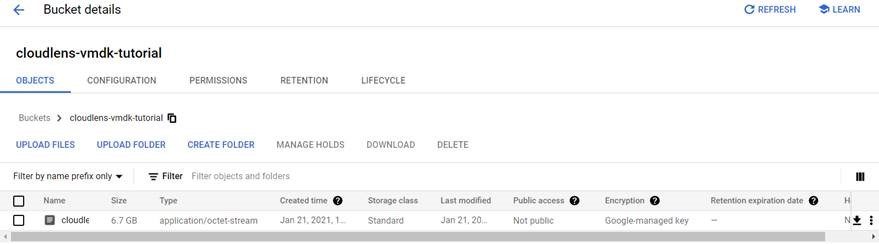
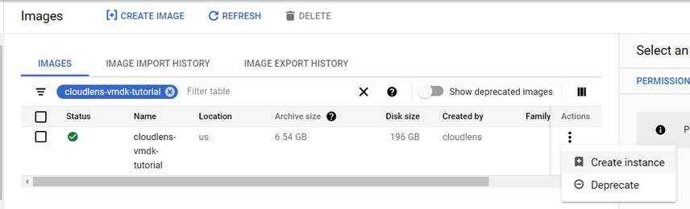
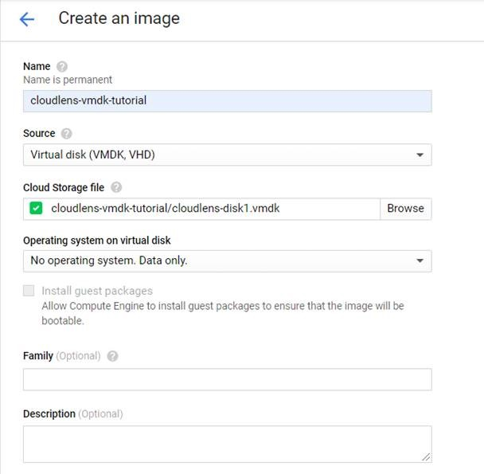
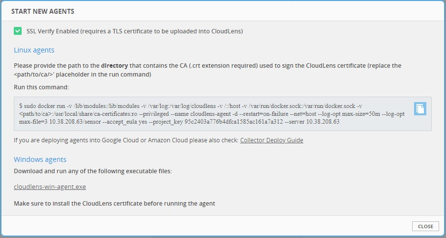
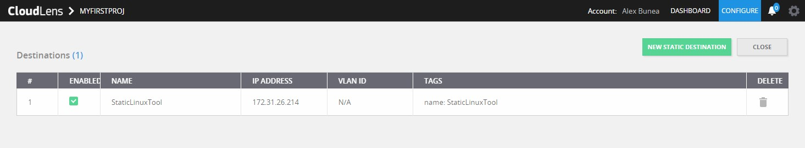

# Workflow

The workflow for getting started with CloudLens Manager is as follows:

1.  <u>Deploy CloudLens Manager</u>

2.  <u>Log in</u> to CloudLens Manager as an Operational user

3.  In CloudLens Manager, <u>create a project</u>.

4.  On the project page, <u>launch the instances</u> that you want to
    monitor (tapped VMs) or use for monitoring and analysis
    (tool-hosting VMs).

5.  On the project page, <u>define groups</u> for the instances (tap
    groups for the tapped VMs, tool groups for the tool-hosting VMs).

6.  <u>Connect</u> the instance and tool groups to each other.

7.  <u>Configure the connection</u> for the type of traffic you want to
    send (the connection properties).

# Deploying CloudLens Manager

CloudLens Manager can be deployed on the following platforms.

-   VMware ESXi (standalone or vCenter)

-   KVM

-   Amazon AWS

-   Google Cloud

-   Microsoft Azure

## 

<table>
<tbody>
<tr class="odd">
<td></td>
<td><ul>
<li></li>
<li></li>
</ul>
<ul>
<li></li>
<li></li>
</ul></td>
</tr>
</tbody>
</table>

## Google Cloud

For deployment on Google Cloud Platform (GCP), CloudLens Manager is
supplied as a VMDK file.

To deploy CloudLens Manager on Google Cloud:

1.  Download the VMDK file from the Keysight website.

2.  Log in to Google Cloud.

3.  Import the file into Cloud Storage:

    1.  Open Storage.

    2.  Click Create Bucket.

    3.  Open the new bucket, click Upload files, and select the VMDK
        file.

> 

4.  Create an image from the VMDK file:

    1.  Click Compute Engine \| Storage \| Images.

    2.  Click Create Image.

    3.  Specify a name for your VM.

    4.  Select the Source Virtual Disk you want to use.

    5.  Specify the path to the storage file.

> 

6.  Click Create.

> 

5.  Create an instance based on the imported image:

    1.  Click Actions.

    2.  Click Create Instance.

> 

3.  Select at least a 4GB CPU and 16GB of RAM.

4.  Click Create Instance.

<!-- -->

6.  To access CloudLens Manager, open a web browser and enter instance's
    IP address in the URL field (https://&lt;vm-ip-address&gt;).

# Logging in

The default credentials for the CloudLens admin account are:

| username: | admin          |
|-----------|----------------|
| password: | Cl0udLens@dm!n |

To login to CloudLens Manager:

1.  In a web browser, access the following URL:

> https://&lt;VM IP address&gt;/startup where &lt;VM IP address&gt; is
> the IP address of the VM where you deployed CloudLens Manager.

2.  Choose one:

    -   If you already have an account, click Login, then enter your
        account username and password into the fields.

    -   If you need to create an account, select **Create User**, create
        an account, then enter your

> new account username and password into the fields.
>
> **Note:** The Create User option only displays if the admin user
> allows it.
>
> After you login, the initial page that displays depends on whether you
> logged in as an admin user or an operational user:

-   If you logged in as an admin user, the Cluster Statistics page
    displays as the initial page. You can view the statistics on this
    page or use the other pages to perform admin tasks in the CloudLens
    Manager deployment.

-   If you logged in as an operational user, the Project wizard
    displays.

> You can use the wizard to guide you in creating a project, or you can
> skip the wizard. If you decide to skip the wizard, you can create your
> project manually.

# CloudLens for operational users

## Getting Started with CloudLens Manager

When you login to CloudLens Manager for the first time, the project
wizard starts, and takes you through the process of creating a new
project. The wizard guides you in:

-   Setting up a sample tool (ntopng) that you can use to monitor
    traffic

-   Integrate the sensor into your application by using Docker

-   Creating a tool group that contains the ntopng instance

-   Creating an instance group that contains your application instances

You can run through the wizard, or skip it and re-run it at a later
time.

After you login and the project wizard displays, choose one:

-   Run the through the wizard and create your projects

-   Skip the wizard and create your project manually, or perform other
    tasks

### Launching sensors

You can launch new Linux or Windows sensors for tapping or for adding to
a tool group.

#### Linux installation

To launch a Linux sensor:

1.  Open a console window to the Linux VM and access the command line.

2.  In CloudLens Manager, display the project that you want to add the
    sensor to.

3.  On the project's Configuration page, click Launch Agent.

4.  The Start new agents window displays.

> 

5.  Copy the sample Docker command from the Start new agents window and
    paste it into the Linux VM's console window.

6.  Modify the command parameters as necessary.

7.  Execute the Docker command.

After a short delay, the new sensor will display in the project list's
of sensors.

1.  
2.  
3.  
4.  
5.  
6.  
7.  

<table>
<tbody>
<tr class="odd">
<td></td>
<td></td>
</tr>
<tr class="even">
<td></td>
<td></td>
</tr>
<tr class="odd">
<td></td>
<td></td>
</tr>
<tr class="even">
<td></td>
<td><ol type="a">
<li></li>
<li></li>
</ol></td>
</tr>
<tr class="odd">
<td></td>
<td></td>
</tr>
</tbody>
</table>

-   
-   

8.  

#### 

##### 

|     |     |
|-----|-----|
|     |     |

<table>
<tbody>
<tr class="odd">
<td></td>
<td></td>
</tr>
<tr class="even">
<td></td>
<td></td>
</tr>
<tr class="odd">
<td></td>
<td></td>
</tr>
<tr class="even">
<td></td>
<td><table>
<tbody>
<tr class="odd">
<td></td>
<td></td>
</tr>
</tbody>
</table></td>
</tr>
<tr class="odd">
<td></td>
<td><table>
<tbody>
<tr class="odd">
<td></td>
<td></td>
</tr>
</tbody>
</table></td>
</tr>
<tr class="even">
<td></td>
<td></td>
</tr>
<tr class="odd">
<td></td>
<td></td>
</tr>
<tr class="even">
<td></td>
<td></td>
</tr>
</tbody>
</table>

##### 

|     |     |
|-----|-----|
|     |     |
|     |     |
|     |     |
|     |     |
|     |     |
|     |     |
|     |     |
|     |     |
|     |     |

#### Firewall ports

This page describes the TCP and UDP ports that must open for CloudLens
Manager.

##### Sensors

The following ports must be open so that sensors can communicate with
CloudLens Manager:

<table>
<thead>
<tr class="header">
<th><blockquote>

<strong>Protocol</strong>

</blockquote></th>
<th><strong>Port Number</strong></th>
<th><strong>Direction</strong></th>
<th><strong>Host</strong></th>
</tr>
</thead>
<tbody>
<tr class="odd">
<td><blockquote>

TCP

</blockquote></td>
<td>443</td>
<td>Inbound and Outbound</td>
<td>CloudLens Manager IP or hostname</td>
</tr>
</tbody>
</table>

##### Tap groups and tool groups

Depending on the encapsulation selected for the connection between a tap
group containing tap sensors and a tool group containing tool sensors or
static destinations, the following ports and protocols must be open:

<table>
<thead>
<tr class="header">
<th><blockquote>

<strong>Connection</strong>

</blockquote></th>
<th><strong>Protocol</strong></th>
<th><strong>Port</strong></th>
<th><blockquote>

<strong>Direction</strong>

</blockquote></th>
<th></th>
</tr>
</thead>
<tbody>
<tr class="odd">
<td></td>
<td></td>
<td></td>
<td><strong>Tap</strong></td>
<td><strong>Tool / Static Destination</strong></td>
</tr>
<tr class="even">
<td><blockquote>

VXLAN

</blockquote></td>
<td>UDP</td>
<td>4789</td>
<td>Outbound</td>
<td>Inbound</td>
</tr>
<tr class="odd">
<td><blockquote>

GRE

</blockquote></td>
<td>GRE (IP Proto 47)</td>
<td>N/A</td>
<td>Outbound</td>
<td>Inbound</td>
</tr>
<tr class="even">
<td><blockquote>

ERSPAN

</blockquote></td>
<td>GRE (IP Proto 47)</td>
<td>N/A</td>
<td>Outbound</td>
<td>Inbound</td>
</tr>
<tr class="odd">
<td><blockquote>

VLAN

</blockquote></td>
<td>802.1Q</td>
<td>N/A</td>
<td>Outbound</td>
<td>Inbound</td>
</tr>
<tr class="even">
<td><blockquote>

Encrypted (see note below)

</blockquote></td>
<td>UDP</td>
<td>9993</td>
<td>Outbound to Internet</td>
<td>Outbound to Internet</td>
</tr>
<tr class="odd">
<td><blockquote>

Encrypted (see note

</blockquote></td>
<td>UDP</td>
<td>19993</td>
<td>Inbound / Outbound to</td>
<td>Inbound / Outbound to</td>
</tr>
<tr class="even">
<td><blockquote>

<strong>Connection</strong>

</blockquote></td>
<td><blockquote>

<strong>Protocol</strong>

</blockquote></td>
<td><blockquote>

<strong>Port</strong>

</blockquote></td>
<td><strong>Dir</strong></td>
<td><strong>ection</strong></td>
</tr>
<tr class="odd">
<td></td>
<td></td>
<td></td>
<td><blockquote>

<strong>Tap</strong>

</blockquote></td>
<td><blockquote>

<strong>Tool / Static Destination</strong>

</blockquote></td>
</tr>
<tr class="even">
<td><blockquote>

below)

</blockquote></td>
<td></td>
<td></td>
<td><blockquote>

tool

</blockquote></td>
<td><blockquote>

tap

</blockquote></td>
</tr>
</tbody>
</table>

> **Note:** For more information about the Encrypted connection, see
> <u>https://zerotier.atlassian.net/wiki/spaces/SD/pages/6815768/Router+Configuration+Tips</u>

#### 

<table>
<tbody>
<tr class="odd">
<td><ul>
<li></li>
<li></li>
</ul></td>
</tr>
</tbody>
</table>

|     |
|-----|
|     |

<table>
<tbody>
<tr class="odd">
<td><ul>
<li></li>
<li></li>
<li></li>
<li></li>
<li></li>
<li></li>
<li></li>
</ul></td>
</tr>
</tbody>
</table>

## 

### 

1.  
2.  
3.  
4.  

|     |     |
|-----|-----|
|     |     |
|     |     |
|     |     |

5.  

### 

1.  
2.  
3.  
4.  

|     |     |
|-----|-----|
|     |     |
|     |     |
|     |     |
|     |     |

5.  

### 

1.  
2.  
3.  
4.  

## Collector mode

In public cloud deployments, you can run sensors in collector mode. In
collector mode, the sensor receives all the traffic information for the
monitored instances from the cloud provider using vTap and forwards it
to another sensor running as a tool or to a static destination for
analysis.

### Google Cloud Packet Mirroring

To use the Google Cloud Packet Mirroring feature
([<u>https://cloud.google.com/vpc/docs/packetmirroring</u>](https://cloud.google.com/vpc/docs/packet-mirroring)),
you configure the sensor as a collector, and it then discovers all the
traffic mirror sessions and the sources attached to that target
instance.

You can add Google Cloud instances by their name, by a tag, or by a
subnet.

The collector instance is transparent and does not display in CloudLens
Manager.

However, all the instances that are forwarding traffic through the vnet
tap towards the collector are visible in CloudLens Manager, as if they
have sensors installed on them.

To function as a collector, the sensor must have the --runmode parameter
set to collector.

If --runmode is omitted or is set to a value other than collector, the
sensor functions as a standard (non-collector) instance.

The procedures for installing and configuring the sensor as a collector
are described in CloudLens Manager . To display them:

1.  Select the Settings icon.

2.  Select Deploy Guide.

3.  Select Install Google CloudLens Collector.
