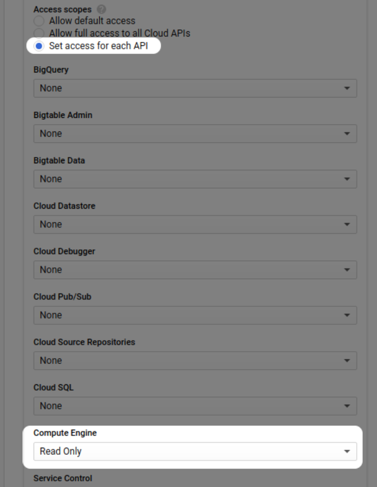

# Workflow

The workflow for getting started with CloudLens Manager is as follows:

1.  <u>Deploy CloudLens Manager</u>

2.  <u>Log in</u> to CloudLens Manager as an Operational user

3.  In CloudLens Manager, <u>create a project</u>.

4.  On the project page, <u>launch the instances</u> that you want to
    monitor (tapped VMs) or use for monitoring and analysis
    (tool-hosting VMs).

5.  On the project page, <u>define groups</u> for the instances (tap
    groups for the tapped VMs, tool groups for the tool-hosting VMs).

6.  <u>Connect</u> the instance and tool groups to each other.

7.  <u>Configure the connection</u> for the type of traffic you want to
    send (the connection properties).

# Deploying CloudLens Manager

CloudLens Manager can be deployed on the following platforms. The
deployment procedure for each platform is described in this section. l
VMware ESXi (standalone or vCenter) l KVM l Amazon AWS l Google Cloud l
Microsoft Azure

## System Requirements

To use CloudLens Manager, you need the following:

<table>
<thead>
<tr class="header">
<th>Web browser (for accessing CloudLens Manager)</th>
<th>l Google Chrome version 87 or later l Screen resolution: 1280 x 1024 minimum</th>
</tr>
</thead>
<tbody>
<tr class="odd">
<td>VM for hosting the sensor</td>
<td>
Linux:

<ul>
<li>
Linux kernel version 3.10 or later
</li>
<li>
Docker must be installed
</li>
</ul>

Windows:

<ul>
<li>
Windows Server 2016 or later
</li>
<li>
Windows 10
</li>
</ul></td>
</tr>
</tbody>
</table>

## Google Cloud

For deployment on Google Cloud Platform (GCP), CloudLens Manager is
supplied as a VMDK file.

To deploy CloudLens Manager on Google Cloud:

1.  Download the VMDK file from the Keysight website.

2.  Log in to Google Cloud.

3.  Import the file into Cloud Storage:

    1.  Open Storage.

    2.  Click Create Bucket.

    3.  Open the new bucket, click Upload files, and select the VMDK
        file.

> 

4.  Create an image from the VMDK file:

    1.  Click Compute Engine \| Storage \| Images.

    2.  Click Create Image.

    3.  Specify a name for your VM.

    4.  Select the Source Virtual Disk you want to use.

    5.  Specify the path to the storage file.

> 

6.  Click Create.

> 

5.  Create an instance based on the imported image:

    1.  Click Actions.

    2.  Click Create Instance.

> 

3.  Select at least a 4GB CPU and 16GB of RAM.

4.  Click Create Instance.

<!-- -->

6.  To access CloudLens Manager, open a web browser and enter instance's
    IP address in the URL field (https://&lt;vm-ip-address&gt;).

# Logging in

The default credentials for the CloudLens admin account are:

| username: | admin          |
|-----------|----------------|
| password: | Cl0udLens@dm!n |

To login to CloudLens Manager:

1.  In a web browser, access the following URL:

> https://&lt;VM IP address&gt;/startup where &lt;VM IP address&gt; is
> the IP address of the VM where you deployed CloudLens Manager.
>
> The CloudLens Manager Startup window displays.
>
> 

2.  Choose one:

    -   If you already have an account, click Login, then enter your
        account username and password into the fields.

    -   If you need to create an account, select **Create User**, create
        an account, then enter your

> new account username and password into the fields.
>
> **Note:**
> The Create User option only displays if the admin user allows it. See
> <u>User</u>

Logging in

> 
>
> After you login, the initial page that displays depends on whether you
> logged in as an admin user or an operational user:

-   If you logged in as an admin user, the Cluster Statistics page
    displays as the initial page. You can view the statistics on this
    page or use the other pages to perform admin tasks in the CloudLens
    Manager deployment.

-   If you logged in as an operational user, the Project wizard
    displays.

> You can use the wizard to guide you in creating a project, or you can
> skip the wizard. If you decide to skip the wizard, you can create your
> project manually. See <u>Creating a new Project on the facing
> page</u>.

# CloudLens for operational users

## Getting Started with CloudLens Manager

When you login to CloudLens Manager for the first time, the project
wizard starts, and takes you through the process of creating a new
project. The wizard guides you in: l Setting up a sample tool (ntopng)
that you can use to monitor traffic l Integrate the sensor into your
application by using Docker l Creating a tool group that contains the
ntopng instance l Creating an instance group that contains your
application instances You can run through the wizard, or skip it and
re-run it at a later time.

After you login and the project wizard displays, choose one: l Run the
through the wizard and create your projects

> l Skip the wizard and create your project manually, or perform other
> tasks. See <u>Creating a new Project below</u>.

### Launching sensors

You can launch new Linux or Windows sensors for tapping or for adding to
a tool group.

#### Linux installation

To launch a Linux sensor:

1.  Open a console window to the Linux VM and access the command line.

2.  In CloudLens Manager, display the project that you want to add the
    sensor to.

3.  On the project's Configuration page, click Launch Agent.

4.  The Start new agents window displays.

> 

5.  Copy the sample Docker command from the Start new agents window and
    paste it into the Linux VM's console window.

6.  Modify the command parameters as necessary. See <u>Docker and
    CloudLens Manager parameters on page 39</u> for a description of the
    parameters.

7.  Execute the Docker command.

After a short delay, the new sensor will display in the project list's
of sensors. **Windows installation**

Use the following procedure to install the sensor on a Windows VM.

> **Note:**
> During installation, the installer will prompt you for the host name,
> API key, and custom tags. This information depends on the CloudLens
> Manager project that the sensor will belong to. If you do not have
> this information, you can complete the installation, but the sensor
> will not work until you supply the missing information.

To install sensor on a Windows VM:

1.  In CloudLens Manager, display the project that you want to add the
    sensor to.

2.  On the project's Configuration page, click Launch Agent.

3.  The Start new agents window displays.

> 

4.  Click the link under Windows agents to download the installer.

5.  Connect to the Windows VM that you want to install the sensor on,
    and copy the installer to the VM.

6.  Double-click the installer to begin the installation.

7.  During the installation, the installer prompts you for the following
    information:

> 

<table>
<thead>
<tr class="header">
<th>Server</th>
<th>Hostname of the CloudLens Manager backend server.</th>
</tr>
</thead>
<tbody>
<tr class="odd">
<td>Project key</td>
<td>Unique value identifying the CloudLens Manager project that the sensor will belong to.</td>
</tr>
<tr class="even">
<td></td>
<td>The API key displays on the project <u>dashboard</u> when you select Show Project Key on the dashboard.</td>
</tr>
<tr class="odd">
<td>Custom Tags</td>
<td>Custom tags to apply to the sensor. See <u>Adding tags</u>.</td>
</tr>
<tr class="even">
<td>Enable autoupdate</td>
<td>
Allows the sensor to automatically download update files from CloudLens Manager and install them to update the sensor.

The default setting is to allow auto-update. If you do not want CloudLens Manager to update itself, clear this checkbox.

If you want to change the auto-update setting:

<ol type="a">
<li>
Open the CloudLens Manager installation directory.
</li>
<li>
Run wingui_x64.exe.
</li>
</ol>

Most updates do not require the CloudLens Manager host to be restarted. If an update does require a restart, CloudLens Manager displays a notification prompting you to install the update manually and restart the host manually.
</td>
</tr>
<tr class="odd">
<td>Enable SSL verification</td>
<td>If enabled, the sensor uses an SSL connection to verify verify the authenticity of the host in the Server field.</td>
</tr>
</tbody>
</table>

> Choose one:

-   If you entered a hostname and tags, select OK to complete the
    installation.

-   If you did not enter a hostname or tags, or only entered partial
    information, select Cancel. The installation will complete, but the
    sensor will not work until you enter complete information.

> The installer prompts you to reboot the VM.

8.  Reboot the VM.

> After rebooting, if you entered complete information, the CloudLens
> sensor starts and joins the project corresponding to the API key. If
> the API key does not exist, the sensor stops.

#### Docker and CloudLens Manager parameters

This section describes the Docker parameters that CloudLens Manager
uses, the native CloudLens Manager parameters used to create the
CloudLens Manager instance, and other installation and configuration
parameters.

For information on Docker, see
[<u>https://docs.Docker.com/engine/reference/run/</u>](https://docs.docker.com/engine/reference/run/).

##### Docker parameters

The Docker parameters apply to sensors on Linux only.

<table>
<tbody>
<tr class="odd">
<td><blockquote>

<strong>Parameter</strong>

</blockquote></td>
<td><strong>Description</strong></td>
</tr>
</tbody>
</table>

<table>
<thead>
<tr class="header">
<th>-d</th>
<th>(Required) Detached mode, run the container in the background.</th>
</tr>
</thead>
<tbody>
<tr class="odd">
<td>--name &lt;name&gt;</td>
<td>(Required) Name of the container.</td>
</tr>
<tr class="even">
<td>
--net=host or

--net=container:container_name
</td>
<td>
(Required) host = tap traffic on the host stack.

container:container_name monitor traffic in a specific container.
</td>
</tr>
<tr class="odd">
<td>--privileged</td>
<td>(Required) Grant extended privileges to this container.</td>
</tr>
<tr class="even">
<td>
--restart=on-failure or

--restart=always
</td>
<td>
(Strongly recommended) Determines when the container is restarted. The parameter value depends on the version of Docker you are using:

<table>
<thead>
<tr class="header">
<th>Docker v1.12.7 or later</th>
<th>
For Docker v1.12.7 or later, the value for -restart should be on-failure:

--restart=onfailure on-failure ensures that sensor restarts on crashes and on system boot if it was running when the system went down.

on-failure is the preferred choice.
</th>
</tr>
</thead>
<tbody>
<tr class="odd">
<td>Docker v1.12.6 or earlier</td>
<td>For Docker v1.12.6 or earlier, the value for --restart should be always:</td>
</tr>
</tbody>
</table></td>
</tr>
<tr class="odd">
<td></td>
<td><table>
<tbody>
<tr class="odd">
<td></td>
<td>
--

restart=always always causes the container to restart regardless of the exit status, and to always start

on daemon

startup regardless of the current state of the container.
</td>
</tr>
</tbody>
</table>

If you do not want to use the auto restart/ start on boot feature, omit the --restart parameter.
</td>
</tr>
<tr class="even">
<td>-v /:/host</td>
<td>(Required) CloudLens Manager needs to mount the host file system so that it can identify system information (such as the operating system) to report in the sensor details.</td>
</tr>
<tr class="odd">
<td>-v /var/log:/var/log/cloudlens</td>
<td>Allows the container to write persistent logs in the folder /var/log on the host where the container is running.</td>
</tr>
<tr class="even">
<td>
-v

/var/run/docker.sock:/var/run/docker.sock
</td>
<td>
(Required) CloudLens Manager needs to mount the Docker socket (Docker.sock) for automatic updates.

If it cannot mount the Docker socket, you must update CloudLens Manager manually. See <u>Updating CloudLens Manager</u>.
</td>
</tr>
</tbody>
</table>

##### CloudLens Manager parameters

On Linux, you pass the parameters in the Docker container.

The --accept\_eula y parameter and value are mandatory.

<table>
<thead>
<tr class="header">
<th><blockquote>

<strong>Parameter</strong>

</blockquote></th>
<th><strong>Description</strong></th>
</tr>
</thead>
<tbody>
<tr class="odd">
<td><blockquote>

--accept_ eula

</blockquote></td>
<td>
(Required) Accept or reject End User License Agreement (EULA) defined at: https://www.ixia.cloud/eula.

Pass y (yes) to accept or n (no) to reject the EULA.

If you pass n or omit this parameter, the sensor exits.
</td>
</tr>
<tr class="even">
<td><blockquote>

--project_ key &lt;apikey&gt;

</blockquote></td>
<td>(Required) API key of the project that this sensor will be part of. The API key is automatically generated and displays on the dashboard as Project Key when you click Show Project Key on the dashboard.</td>
</tr>
<tr class="odd">
<td><blockquote>

--custom_ tags name<em>X</em>=value<em>X</em>

</blockquote></td>
<td>CloudLens Manager-specific tags applied to this instance. See <u>Adding Tags</u>.</td>
</tr>
<tr class="even">
<td><blockquote>

--listen

&lt;interface&gt;

</blockquote></td>
<td>
Specific interfaces to capture packets from. For multiple interfaces, pass this parameter multiple times.

For example: --listen interface1 interface2 interface3 If not specified, the sensor listens on all interfaces.
</td>
</tr>
<tr class="odd">
<td><blockquote>

--log-opt maxsize=&lt;value&gt;

</blockquote></td>
<td>
Amount of space, in MB, allocated for one sensor log file.

The default is 50MB.
</td>
</tr>
<tr class="even">
<td><blockquote>

--log-opt maxfile=&lt;value&gt;

</blockquote></td>
<td>
Number of sensor log files used on the instance.

The default is 3.

The total amount of space allocated for log files on the instance is:

--log-opt max-size multiplied by --log-opt max-file For example:

--log-opt max-size (default: 50MB) * --log-opt max-file (default: 3) = 150MB
</td>
</tr>
<tr class="odd">
<td><blockquote>

--out_ interface &lt;interface_ name&gt;

</blockquote></td>
<td>
Name of the interface used to mirror the traffic.

When this parameter is specified for a tool group instance, the sensor propagates the information to all instances from the tap groups connected to it to mirror the traffic (establish a tunnel) using the specified interface.

If a route cannot be established from a tap instance to the tool instance using the specified interface, you can specify the --out_interface parameter on a tap instance to force the route between tap and tool instances, but only if that route exists.
</td>
</tr>
<tr class="even">
<td><blockquote>

--runmode

</blockquote></td>
<td>Configures CloudLens Manager to run as a traffic collector in an Azure deployment.</td>
</tr>
<tr class="odd">
<td></td>
<td>
To configure CloudLens Manager to run as a collector, pass this parameter with a value of collector:

--runmode collector

If this parameter is omitted or passed with any value other than collector, the sensor runs as a standard (non-collector) sensor.
</td>
</tr>
</tbody>
</table>

#### Firewall ports

This page describes the TCP and UDP ports that must open for CloudLens
Manager.

##### Sensors

The following ports must be open so that sensors can communicate with
CloudLens Manager:

<table>
<thead>
<tr class="header">
<th><blockquote>

<strong>Protocol</strong>

</blockquote></th>
<th><strong>Port Number</strong></th>
<th><strong>Direction</strong></th>
<th><strong>Host</strong></th>
</tr>
</thead>
<tbody>
<tr class="odd">
<td><blockquote>

TCP

</blockquote></td>
<td>443</td>
<td>Inbound and Outbound</td>
<td>CloudLens Manager IP or hostname</td>
</tr>
</tbody>
</table>

##### Tap groups and tool groups

Depending on the encapsulation selected for the connection between a tap
group containing tap sensors and a tool group containing tool sensors or
static destinations, the following ports and protocols must be open:

<table>
<thead>
<tr class="header">
<th><blockquote>

<strong>Connection</strong>

</blockquote></th>
<th><strong>Protocol</strong></th>
<th><strong>Port</strong></th>
<th><blockquote>

<strong>Direction</strong>

</blockquote></th>
<th></th>
</tr>
</thead>
<tbody>
<tr class="odd">
<td></td>
<td></td>
<td></td>
<td><strong>Tap</strong></td>
<td><strong>Tool / Static Destination</strong></td>
</tr>
<tr class="even">
<td><blockquote>

VXLAN

</blockquote></td>
<td>UDP</td>
<td>4789</td>
<td>Outbound</td>
<td>Inbound</td>
</tr>
<tr class="odd">
<td><blockquote>

GRE

</blockquote></td>
<td>GRE (IP Proto 47)</td>
<td>N/A</td>
<td>Outbound</td>
<td>Inbound</td>
</tr>
<tr class="even">
<td><blockquote>

ERSPAN

</blockquote></td>
<td>GRE (IP Proto 47)</td>
<td>N/A</td>
<td>Outbound</td>
<td>Inbound</td>
</tr>
<tr class="odd">
<td><blockquote>

VLAN

</blockquote></td>
<td>802.1Q</td>
<td>N/A</td>
<td>Outbound</td>
<td>Inbound</td>
</tr>
<tr class="even">
<td><blockquote>

Encrypted (see note below)

</blockquote></td>
<td>UDP</td>
<td>9993</td>
<td>Outbound to Internet</td>
<td>Outbound to Internet</td>
</tr>
<tr class="odd">
<td><blockquote>

Encrypted (see note

</blockquote></td>
<td>UDP</td>
<td>19993</td>
<td>Inbound / Outbound to</td>
<td>Inbound / Outbound to</td>
</tr>
<tr class="even">
<td><blockquote>

<strong>Connection</strong>

</blockquote></td>
<td><blockquote>

<strong>Protocol</strong>

</blockquote></td>
<td><blockquote>

<strong>Port</strong>

</blockquote></td>
<td><strong>Dir</strong></td>
<td><strong>ection</strong></td>
</tr>
<tr class="odd">
<td></td>
<td></td>
<td></td>
<td><blockquote>

<strong>Tap</strong>

</blockquote></td>
<td><blockquote>

<strong>Tool / Static Destination</strong>

</blockquote></td>
</tr>
<tr class="even">
<td><blockquote>

below)

</blockquote></td>
<td></td>
<td></td>
<td><blockquote>

tool

</blockquote></td>
<td><blockquote>

tap

</blockquote></td>
</tr>
</tbody>
</table>

> **Note:**
> For more information about the Encrypted connection, see
> [<u>https://zerotier.atlassian.net/wiki/spaces/SD/pages/6815768/Router+Configuration+Tips</u>](https://zerotier.atlassian.net/wiki/spaces/SD/pages/6815768/Router+Configuration+Tips)

#### Sidecar deployment in Kubernetes

You can use the The CloudLens sensor for Linux instances to tap PODs
from a Kubernetes cluster, whether they are managed (by EKS, AKS, GKE
etc.) or un-managed.

The PODs can be standalone or part of a Deployment, a ReplicaSet, etc.
For POD tapping, the sensor is deployed as a sidecar (another container)
inside the POD. At POD creation, the sensor Docker image is pulled from
the same Docker Image Registry from where the other images (application
images) are pulled.

Therefore, you must upload the sensor Docker image to the Image Registry
before the POD is created.

Below are two .yaml files: The first file defines a Busybox deployment,
and the second file is the same deployment with the addition of the
CloudLens sidecar for each POD of the deployment.

If a custom TLS certificate was not added to the CloudLens Manager, you
must pass the --ssl\_verify no argument in the args section. This
argument causes the CloudLens Manager TLS certificate to not be verified
when the sensor connects to CloudLens Manager.

For example:

args: \["--auto\_update","n","--project\_key","&lt;Project
Key&gt;","--accept\_eula","yes","-server","&lt;CloudLens Manager
IP&gt;","--custom\_tags","key1=value1","--ssl\_verify no"\]

&lt;Project Key&gt; is the API key of the CloudLens Manager project that
the sidecar container will connect to. You can find the Project Key on
the CloudLens Manager Project page:

&lt;CloudLens Manager IP&gt; is the IP address or hostname of the
CloudLens Manager that the sidecar sensor will connect to.

**Without sidecar:**

<table>
<tbody>
<tr class="odd">
<td>
apiVersion: apps/v1 kind: Deployment metadata:

name: alex-deployment-app spec:

replicas: 2 selector:

matchLabels:

app: alex-deployment-app template:

metadata:

labels:

app: alex-deploymentapp

spec:

containers:

<ul>
<li>
name: busybox image: busybox command: - sleep
</li>
<li>
"3600"
</li>
</ul></td>
</tr>
</tbody>
</table>

**With Sidecar:**

<table>
<tbody>
<tr class="odd">
<td>
apiVersion: apps/v1 kind: Deployment metadata:

name: alex-deployment-app spec:

replicas: 2 selector:

matchLabels:

app: alex-deployment-app
</td>
</tr>
</tbody>
</table>

<table>
<tbody>
<tr class="odd">
<td>
template:

metadata:

labels:

app: alex-deployment-app spec:

containers:

<ul>
<li>
name: busybox image: busybox command: - sleep
</li>
<li>
"3600"
</li>
<li>
name: sidecar
</li>
</ul>

image: &lt;Sensor Image Path on the Repository&gt;

args: ["--auto_update","n","--project_key","&lt;Project Key&gt;","--accept_eula","yes","-server","&lt;CloudLens Manager IP&gt;","--custom_tags","key1=value1"] volumeMounts:

<ul>
<li>
mountPath: /var/log/cloudlens
</li>
</ul>

name: volume1

<ul>
<li>
mountPath: /host
</li>
</ul>

name: volume2

<ul>
<li>
mountPath: /lib/modules
</li>
</ul>

name: volume3

<ul>
<li>
mountPath: /var/run/docker.sock name: volume4 securityContext:
</li>
</ul>

allowPrivilegeEscalation: true privileged: true capabilities:

add: ["SYS_RAWIO", "SYS_RESOURCE", "SYS_ADMIN", "NET_ADMIN", "NET_RAW"] volumes: - name: volume1 hostPath:

path: /var/log

type: Directory - name: volume2 hostPath: path: /

type: Directory - name: volume3 hostPath:

path: /lib/modules

type: Directory - name: volume4 hostPath:

path: /var/run/docker.sock

type: Socket
</td>
</tr>
</tbody>
</table>

## Static destinations

Static destinations are tool instances that are accessed by their IP
address or VLAN ID.

### Adding a static destination

To add a static destination:

1.  Display the project's Configuration page.

2.  Click Destinations.

> The Destinations page displays, showing the list of static
> destinations configured in the project.
>
> 

3.  Click New Static Destination.

The Add Destination window displays.

> 

4.  Configure the fields in the window.

<table>
<thead>
<tr class="header">
<th>Destination Enabled</th>
<th>
If checked, the destination is active and available for use.

If disabled, the destination is not available.
</th>
</tr>
</thead>
<tbody>
<tr class="odd">
<td>Name</td>
<td>Name for the destination.</td>
</tr>
<tr class="even">
<td>IP Address / VLAN ID</td>
<td>
Selects the method used to route traffic to the destination.

Enter the IP address or VLAN ID in the field.
</td>
</tr>
<tr class="odd">
<td>Tags</td>
<td>
List of tags applied to the destination.

Tags help you to sort and filter destinations in lists.

By default, CloudLens Manager automatically applies the destination's name as a tag.

If you want to apply additional tags, enter the tag data in the Key and Value fields.
</td>
</tr>
</tbody>
</table>

5.  Click OK to add the destination.

### Modify a static destination

You can enable or disable a destination, or modify its properties
(except for its name).

To edit a static destination:

1.  Display the project's Configuration page.

2.  Click Destinations.

The Destinations page displays, showing the list of static destinations
configured in the project.

> 

3.  Click anywhere in the row that contains the destination that you
    want to modify The Add Destination window displays.

> 

4.  Configure the fields in the window.

<table>
<thead>
<tr class="header">
<th>Destination Enabled</th>
<th>
If checked, the destination is active and available for use.

If disabled, the destination is not available.
</th>
</tr>
</thead>
<tbody>
<tr class="odd">
<td>Name</td>
<td>Name for the destination.</td>
</tr>
<tr class="even">
<td>IP Address / VLAN ID</td>
<td>
Selects the method used to route traffic to the destination.

Enter the IP address or VLAN ID in the field.
</td>
</tr>
<tr class="odd">
<td>Tags</td>
<td>
List of tags applied to the destination.

Tags help you to sort and filter destinations in lists.

By default, CloudLens Manager automatically applies the destination's name as a tag.
</td>
</tr>
<tr class="even">
<td></td>
<td>If you want to apply additional tags, enter the tag data in the Key and Value fields.</td>
</tr>
</tbody>
</table>

5.  Click OK to add the destination.

### Deleting a static destination

To delete a static destination:

1.  Display the project's Configuration page.

2.  Click Destinations.

The Destinations page displays, showing the list of static destinations
configured in the project.

> 

3.  In the row for the destination, click Delete.

4.  Click OK to configrm deleting the destination.

## Collector mode

In public cloud deployments, you can run sensors in collector mode. In
collector mode, the sensor receives all the traffic information for the
monitored instances from the cloud provider using vTap and forwards it
to another sensor running as a tool or to a static destination for
analysis.

### Google Cloud Packet Mirroring

To use the Google Cloud Packet Mirroring feature
([<u>https://cloud.google.com/vpc/docs/packetmirroring</u>](https://cloud.google.com/vpc/docs/packet-mirroring)),
you configure the sensor as a collector, and it then discovers all the
traffic mirror sessions and the sources attached to that target
instance.

You can add Google Cloud instances by their name, by a tag, or by a
subnet.

The collector instance is transparent and does not display in CloudLens
Manager.

However, all the instances that are forwarding traffic through the vnet
tap towards the collector are visible in CloudLens Manager, as if they
have sensors installed on them.

To function as a collector, the sensor must have the --runmode parameter
set to collector.

If --runmode is omitted or is set to a value other than collector, the
sensor functions as a standard (non-collector) instance.

For more information on sensor parameters, see <u>Docker and CloudLens
Manager parameters on page 39</u>.

The procedures for installing and configuring the sensor as a collector
are described in CloudLens Manager . To display them:

1.  Select the Settings icon.

2.  Select Deploy Guide.

3.  Select Install Google CloudLens Collector.
